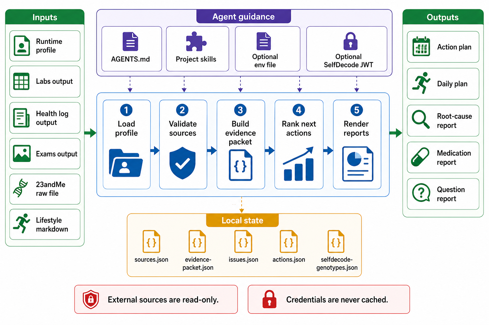

<div align="center">
  

  # healthpilot

  **🧭 Turn parsed health records into ranked next steps 🧭**
</div>

healthpilot is a local, file-based workflow for turning parsed health records into ranked next steps. It connects runtime profiles, labs, exams, health-log entries, medications, supplements, lifestyle notes, genetics, and project Codex skills into one longitudinal planning loop.

The canonical interface is the `what-next-report` skill through the agent. The Python CLI exists as deterministic support for rescans, evidence packets, cached SNP lookups, and draft daily plans.

## Install

```bash
git clone https://github.com/tsilva/healthpilot.git
cd healthpilot
python3 -m pip install -e ".[dev]"
```

Create a runtime profile outside the repo:

```bash
mkdir -p ~/.config/healthpilot/profiles
cp profiles/template.yaml.example ~/.config/healthpilot/profiles/myname.yaml
```

Edit `~/.config/healthpilot/profiles/myname.yaml` so it points at the parser outputs and optional source files for that profile.

Then invoke the agent from this repo with a prompt like:

```text
Use the what-next-report skill for profile myname and write the refreshed next-steps report.
```

Reports are written under `.output/<profile_slug>/`.

## Commands

```bash
pytest                                      # run tests
healthpilot plan --profile myname          # refresh state and render the action plan
healthpilot evidence-packet --profile myname
healthpilot daily-plan --profile myname --date 2026-04-29
healthpilot selfdecode-genotypes --profile myname --rsids rs429358 rs7412
```

Deprecated aliases such as `healthpilot intake`, `healthpilot review`, and `healthpilot outcome-update` still route to `plan` for compatibility.

## Notes

- Requires Python 3.11 or newer.
- Runtime profiles live in `~/.config/healthpilot/profiles/`; repo-local `profiles/*.yaml` are development references only.
- Optional API keys belong in `~/.config/healthpilot/.env`; `.env.example` documents the supported `NCBI_API_KEY`.
- Profile-linked labs, exams, health-log, genetics, and lifestyle files are read-only source inputs.
- Derived state lives under `.state/profiles/<profile_slug>/`; user-facing reports live under `.output/<profile_slug>/`.
- The primary data sources are `labs-parser`, `medical-exams-parser`, `health-log-parser`, optional raw 23andMe data, optional SelfDecode genotype lookups, and optional lifestyle Markdown files.
- SelfDecode JWTs are transient credentials. The cache stores genotype results only, in `.state/profiles/<profile_slug>/selfdecode-genotypes.json`.
- Project skills live under `.codex/skills/`: `what-next-report`, `root-cause-analysis`, `profile-question-report`, and `medication-history-report`.

## Architecture



## License

[MIT](LICENSE)
