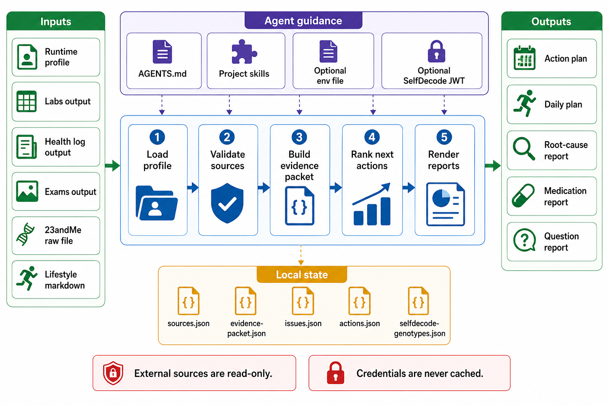

<div align="center">
  

  # healthpilot

  **🧭 Turn parsed health records into ranked next steps 🧭**
</div>

healthpilot is a local, file-based workflow for turning parsed health records into ranked next steps. It connects runtime profiles, labs, exams, health-log entries, medications, supplements, lifestyle notes, genetics, and project Codex skills into one longitudinal planning loop.

The canonical interface is the `healthpilot-report-what-next` skill through the agent. The Python CLI exists as deterministic support for rescans, evidence packets, cached SNP lookups, and draft daily plans.

## Install

```bash
git clone https://github.com/tsilva/healthpilot.git
cd healthpilot
python3 -m pip install -e ".[dev]"
```

Create a runtime profile outside the repo:

```bash
mkdir -p ~/.config/healthpilot/profiles
cp profiles/template.yaml.example ~/.config/healthpilot/profiles/myname.yaml
```

Edit `~/.config/healthpilot/profiles/myname.yaml` so it points at the parser outputs and optional source files for that profile.

Then invoke the agent from this repo with a prompt like:

```text
Use the healthpilot-report-what-next skill for profile myname and write the refreshed next-steps report.
```

Reports are bucketed under `.output/<profile_slug>/<report_type>/` and every filename starts with `<YYYY-MM-DD>-`. For example, what-next reports live at `.output/<profile_slug>/what-next/<YYYY-MM-DD>-<profile_slug>-action-plan.md`. Reports open with a decision layer, show changes since the prior comparable report, and keep source coverage and audit detail in an evidence appendix. What-next reports also include current status, a Now/Next/Later action board, and researched self-experiments when defensible.

## Commands

```bash
pytest                                      # run tests
./sync.sh                                   # sync every live profile
./sync.sh --profile myname                  # sync one live profile
healthpilot plan --profile myname          # refresh deterministic evidence and state
healthpilot evidence-packet --profile myname
healthpilot daily-plan --profile myname --date 2026-04-29
healthpilot selfdecode-genotypes --profile myname --rsids rs429358 rs7412
healthpilot validate-report --type what-next --report .output/myname/what-next/2026-08-11-myname-action-plan.md
healthpilot migrate-output-layout            # dry-run manifest
healthpilot migrate-output-layout --apply    # migrate recognized history
```

Deprecated aliases such as `healthpilot intake`, `healthpilot review`, and `healthpilot outcome-update` still route to `plan` for compatibility.

## Notes

- Requires Python 3.11 or newer.
- Runtime profiles live in `~/.config/healthpilot/profiles/`; repo-local `profiles/*.yaml` are development references only.
- Optional API keys belong in `~/.config/healthpilot/.env`; `.env.example` documents the supported `NCBI_API_KEY`.
- Profile-linked labs, exams, health-log, genetics, and lifestyle files are read-only source inputs.
- Derived state lives under `.state/profiles/<profile_slug>/`; user-facing reports live under `.output/<profile_slug>/<report_type>/`.
- Evidence packets use report-safe citation IDs in user-facing artifacts while retaining private path resolution under `.state/`.
- The primary data sources are `labs-parser`, `medical-exams-parser`, `health-log-parser`, optional raw 23andMe data, optional SelfDecode genotype lookups, and optional lifestyle Markdown files.
- Optional Google Health wearable evidence uses one shared Desktop OAuth app and profile-isolated credentials/cache under `~/.config/healthpilot/google-health/`. See [setup, retrieval, and report integration](docs/google-health.md). Unconnected profiles continue to work.
- SelfDecode JWTs are transient credentials. The cache stores genotype results only, in `.state/profiles/<profile_slug>/selfdecode-genotypes.json`.
- Project report skills live under `.codex/skills/` and share the `healthpilot-report-` prefix: `healthpilot-report-what-next`, `healthpilot-report-root-cause`, `healthpilot-report-treatment-record`, `healthpilot-report-organ-system-health`, `healthpilot-report-mortality-risk`, and `healthpilot-report-doctor-appointment`.
- Printable colour-coded medication tables use `healthpilot-medication-sheet`. The skill reconciles the current regimen for a selected live profile and writes a one-page PDF under `.output/<profile_slug>/treatment-record/` without modifying profile-linked source files.
- Profile gap-filling uses `healthpilot-profile-interview`, which asks high-yield questions and creates a paste-ready health-log entry rather than a report.
- Appointment preparation uses `healthpilot-report-doctor-appointment`. It creates a facts-only one-page clinician PDF and a detailed patient PDF with the relevant printable labs, exams, imaging, or other supporting records merged into it. For a confirmed repeat visit with the same named clinician, the handout highlights only what is new since the latest completed visit.

## Architecture



## License

[MIT](LICENSE)
